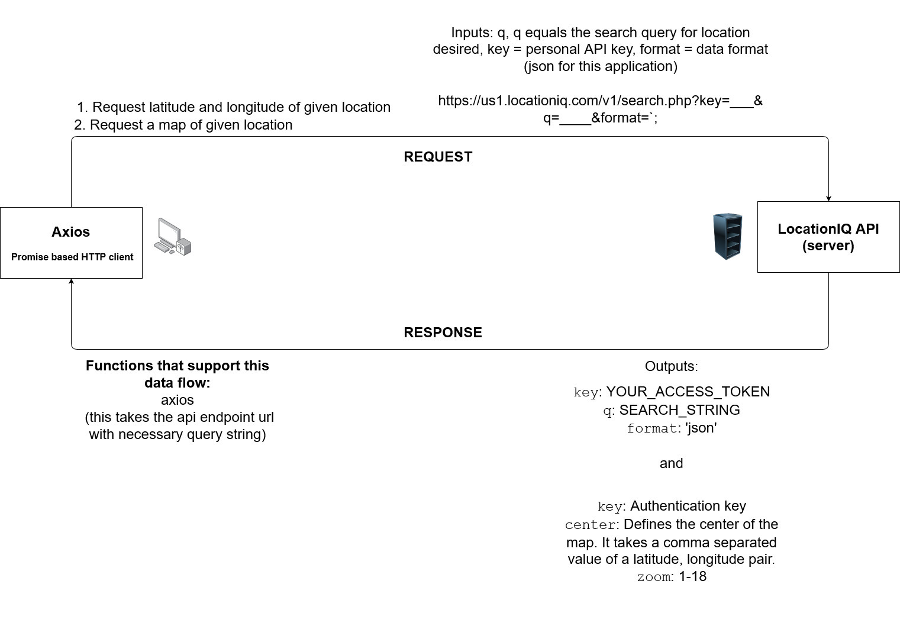

# City Explorer

**Author**: Ryan Emmans
**Version**: 1.5.0
<!-- (increment the patch/fix version number if you make more commits past your first submission) -->

- - -

## ***Deploy Status:***

## Overview
<!-- Provide a high level overview of what this application is and why you are building it, beyond the fact that it's an assignment for this class. (i.e. What's your problem domain?) -->

### Asynchronous code, and APIs

Today you will be building a React application that uses the Axios library to make user-initiated requests for data from a third-party API.

## Getting Started
<!-- What are the steps that a user must take in order to build this app on their own machine and get it running? -->

## Architecture
<!-- Provide a detailed description of the application design. What technologies (languages, libraries, etc) you're using, and any other relevant design information. -->
- [React](https://reactjs.org/docs/getting-started.html)
- [Axios on NPM](https://www.npmjs.com/package/axios)
- [React Bootstrap](https://react-bootstrap.github.io/getting-started/introduction)
- [Locations IQ Geocoding API](https://locationiq.com/)

## Change Log
<!-- Use this area to document the interactive changes made to your application as each feature is successfully implemented. Use time stamps. Here's an example:

01-01-2001 4:59pm - Application now has a fully-functional express server, with a GET route for the location resource. -->

08-23-2021 4:00pm - Completed setup of City Explorer repository, with LocationIQ access token and Netlify deployment.

08-23-2021 6:00pm - Built form to search locations with LocationIQ API, added latitude and longitude coordinates.

08-23-2021 9:00pm - Added map image and page styling using React Bootstrap.

08-24-2021 1:00pm - Added error message for invalid form input.

08-25-2021 9:00pm - Added rendered weather data to page.

08-27-2021 4:00pm - Added movie database API. Refactored components.

## Credit and Collaborations
<!-- Give credit (and a link) to other people or resources that helped you build this application. -->

- Collaborated with Alex Beers on initial request-response cycle diagram and outline.
- Credit to TAs Hexx King, Michael Eclavea, Chance Harmon, and instructor JB Telles for all their help.

### Additional Resources

- [Stack Overflow](https://stackoverflow.com/)
- [MDN Web Docs](https://developer.mozilla.org/en-US/)

- - -

### Class 06 Time Estimate

Name of feature: 1. Set up your React repository & API keys.

- Estimate of time needed to complete: 30 minutes
- Start time: 2:30pm
- Finish time: 4:00pm
- Actual time needed to complete: 1.5 hours

Name of feature: 2. Locations: As a user of City Explorer, I want to enter the name of a location so that I can see the exact latitude and longitude of that location.

- Estimate of time needed to complete: 2 hours
- Start time: 4:15pm
- Finish time: 6:00pm
- Actual time needed to complete: 1.75 hours

Name of feature: 3. Map: As a user, I want to see a map of the city so that I can see the layout of the area I want to explore.

- Estimate of time needed to complete: 2 hours
- Start time: 6:15pm
- Finish time: 9:00pm
- Actual time needed to complete: 2.75

Name of feature: 4. Errors: As a user, I want clear messages if something goes wrong so I know if I need to make any changes or try again in a different manner.

- Estimate of time needed to complete: 3 hours
- Start time: 12:00pm
- Finish time: 1:00pm
- Actual time needed to complete: 1 hour
